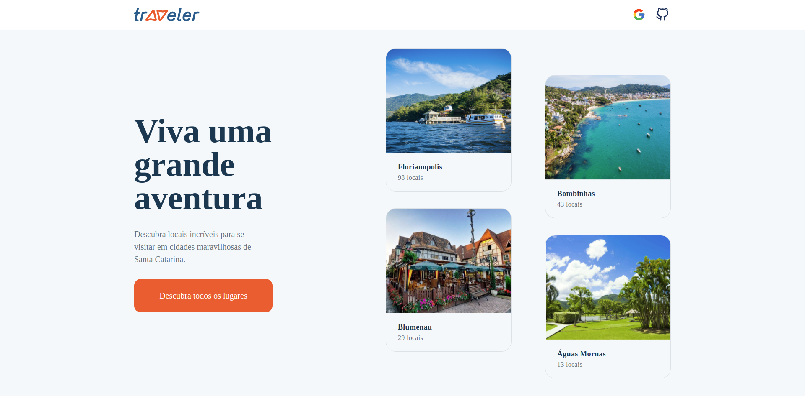

# Traveler

- Design desenvolvido pela rockseat com intuito de por em praticar conceitos de Html, Css, Javascrit e além disso por em pratica tudo que apredeu no curso.

<br>

# 🖥 Tecnologias utilizadas no projeto

✅ Next-Auth - Autenticação

- Criar a autenticação do projeto.

✅ Chakra - CSS declarativo

- Estilização
- Responsividade

✅ React-Icons - Pacote de Icones

- Icones da aplicação

✅ FaunaDB - Banco Serveless

✅ json-server - Servidor fake


<br>

# 🧑‍💻 Densenvolvimento das telas

✔ Pagina Inicial

✔ Listando as cidades

✔ Informando o que cada cidade tem de melhor.

<br>

# Instalação

```html
# Copie e cole no seu terminal $ git clone
https://github.com/OttoSouza/iginite_worldtrip_chapter_IV.git
```

```html
# Acesse a pasta $ cd Traveler 
# Crie um arquivo na raiz do projeto chamada ".env.local" sem as aspas. 
# Adicione as variaveis necessarias. (Variaveis se
# encontra no .env.example) 
# 
# Crie uma conta no Github ou Google 
# 
# Na google precisa-se criar um serviço de ID Client OAuth 2.0:
# https://console.cloud.google.com/ 
# Quando o serviço for criado no final irá gerar os ids necessarios.
#
# No Github acesse: 
# Configuraços -> Configuração de desenvolvedor -> OAuth 
# Crie um serviço e obtenha os ids necessarios.
#
# FaunaDB
# Crie uma conta no fauna e crie um banco no "repositorio" do fauna
# Em Collections crie com o nome "users"
# Em indexes "user_by_email" como unico.
# Feito isso va ate "Security" e crie sua chave.
#
# Por fim gere um JWT pode ser um md5.
#
# Adicionar todas as chaves no arquivo .env.local 
#
# Execute 
$ yarn install (Instalar os pacotes necessarios)
$ yarn dev (Executar a aplicação)
$ yarn server (Executar o servidor fake)
# Acessa pelo browser $
https://localhost:3000
```

<br>



